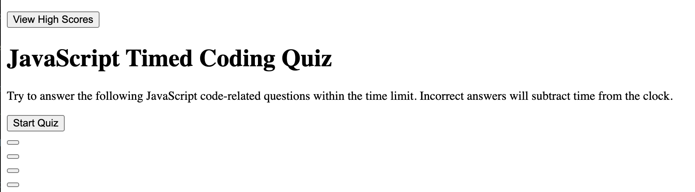
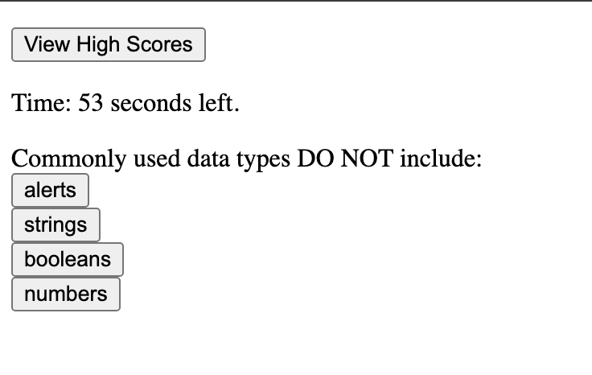

# JavaScript Timed Quiz Application

## Description
This project was a challenge assigned to us where we had to create a timed quiz application with questions about JavaScript. We were not given any starter code and had to start everything from scratch. 

When the start button is clicked, a timer starts and then the user is presented with a question. After the question is answered, another question is displayed until there are no more questions or the timer reaches 0. When a question is answered incorrectly, then time is subtracted from the clock. At the end, you are able to save your initials and score into local storage.

JavaScript is still difficult for me and this challenge proved much more difficult than the last, which was the password generator. I faced many issues just starting out but I found that psuedo coding and creating an image of what I wanted to create, helped me immensely. I originally made each set of question and set of answers as separate HTML elements that I would hide and show, but I found that to be too difficult and moved to appending to the DOM. The problems I struggled with most were local storage code and code that would generate the questions. Only five questions were added to keep it simple and I could not get the local storage part to work perfectly. I only focused on the HTML and JavaScript of the application in order to meet the deadline and maybe in the future I can return to this and make it look better. 

The logic of JavaScript makes sense in some areas but in others, I had to use other resources. I do not completely understand JavaScript yet, especially when it comes to the logic and syntax but I am moving closer to understanding it when I use resources like TAs and tutors in addition to looking up certain topics.

## Usage
This project is a way to study questions about JavaScript through a timed quiz.

[Link to application](https://crzn24.github.io/javascript-timed-quiz-app/)

## Credits

* [HTML Forms](https://www.w3schools.com/html/html_forms.asp)
* [HTML DOM Button Objects](https://www.w3schools.com/jsref/dom_obj_pushbutton.asp)
* [HTML DOM Elements](https://www.w3schools.com/js/js_htmldom_nodes.asp)
* [Clearing intervals](https://www.w3schools.com/jsref/met_win_clearinterval.asp)
* [Subtracting from timers](https://stackoverflow.com/questions/55583960/how-do-i-add-or-subtract-current-seconds-to-a-count-down-timer)
* Michelle Jordan - Tutor
* Nick Gambino TA

## License

MIT License
